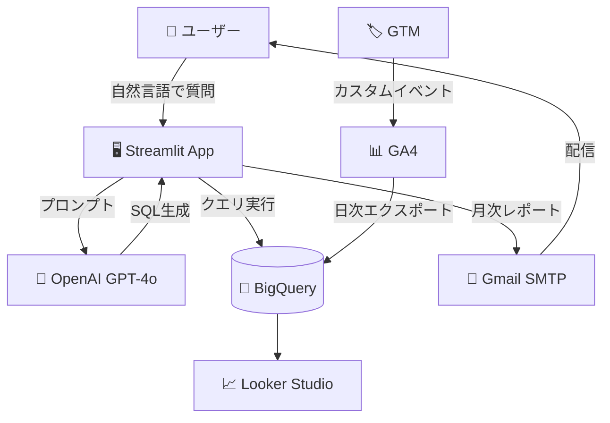

# ark-analytics

> GA4 × BigQuery × AI を組み合わせた、自然言語でデータ分析できる Web アプリ

[](https://ark-analytics.streamlit.app/)
[](https://streamlit.io/)
[]()
[]()

---

## 🎯 何ができるツールか

GA4で計測しているWebサイトのアクセスデータを、**自然言語で質問するだけで分析・可視化**できるツールです。

非エンジニアの担当者でも「先月のお問い合わせフォーム経由のCV数は？」「どのページで離脱が多い？」といった質問を投げるだけで、BigQueryからリアルタイムにデータを取得して、GPT-4oが分析結果と改善提案を返します。

**主なユースケース:**
- マーケ担当者が日次のKPIをチャットで確認する
- 経営層が月次レポートをメールで自動受信する（毎月1日 AM9:00 自動配信）
- 改善施策の優先度をAIが自動スコアリング（実装難度 × ビジネスインパクト）

---

## 🚀 デモ・公開URL

**本番URL**: https://ark-analytics.streamlit.app/

main ブランチへの push で Streamlit Community Cloud に自動デプロイされます。

---

## 🏗️ アーキテクチャ



---

## 🛠️ 技術スタック

| レイヤー | 技術 | バージョン |
|---------|------|-----------|
| フロントエンド | Streamlit | >=1.32.0 |
| AIエンジン | OpenAI GPT-4o | openai==1.40.0 |
| データ基盤 | BigQuery | GCP |
| データ収集 | GA4 | Google Analytics 4 |
| タグ管理 | GTM | Google Tag Manager |
| ダッシュボード | Looker Studio | 5ページ構成 |
| 月次レポート | Python + smtplib | Gmail SMTP |
| デプロイ | Streamlit Community Cloud | 無料プラン |

---

## 📦 セットアップ手順

### 1. リポジトリをクローン

```bash
git clone https://github.com/Ai-Flow-Architect/ark-analytics.git
cd ark-analytics
```

### 2. 仮想環境を作って依存関係をインストール

```bash
python3 -m venv venv
source venv/bin/activate
pip install -r requirements.txt
```

### 3. 環境変数を設定

```bash
cp .env.example .env
# .env を編集して各APIキー・GCPプロジェクトIDを記入
```

主要な環境変数（詳細は `.env.example` 参照）:

| 環境変数 | 用途 | 取得先 |
|---------|------|-------|
| `OPENAI_API_KEY` | GPT-4o分析・QA生成 | https://platform.openai.com/api-keys |
| `GOOGLE_CLOUD_PROJECT` | BigQueryプロジェクトID | GCPコンソール |
| `ARK_GA4_PROPERTY_ID` | GA4プロパティID | GA4管理画面 |
| `ARK_GA4_RAW_DATASET` | BigQueryデータセット名 | BigQueryコンソール |
| `GMAIL_ADDRESS` / `GMAIL_APP_PASSWORD` | レポート配信用 | Googleアプリパスワード |

**本番環境（Streamlit Community Cloud）では `.streamlit/secrets.toml` 形式で管理します。** GCPサービスアカウントJSONも secrets.toml に格納してください。

### 4. ローカル起動

```bash
streamlit run app.py
```

ブラウザで http://localhost:8501 が開きます。

---

## 🧪 テスト

```bash
pytest tests/test_smoke.py -v
```

スモークテストでREADME・.env.example・.gitignore・エントリーポイントの存在を検証します。

---

## 📂 ディレクトリ構成

```
ark-analytics/
├── README.md
├── .env.example
├── .gitignore
├── app.py                  # Streamlitエントリーポイント
├── main.py                 # 月次レポート生成
├── requirements.txt
├── tests/
│   └── test_smoke.py
└── docs/
    └── architecture.md
```

---

## 🔧 主要な機能

### 自然言語QA（app.py）

ブラウザでアクセスし、テキストボックスに日本語で質問するだけ。

例:
- 「先月のお問い合わせフォーム経由のCV数は？」
- 「直帰率が高いページTOP5を教えて」
- 「どの流入チャネルが一番ROIが高い？」

GPT-4oが自動で SQL を生成・BigQuery に問い合わせ・結果を日本語で要約します。

### 月次AIレポート（main.py）

```bash
python main.py
```

毎月1日 AM9:00 にcronで自動実行。前月のデータを集計し、改善提案つきHTMLレポートをクライアントメールに配信します。

### 改善施策スコアリング

QAアプリ内に統合。施策ごとに「実装難度」「ビジネスインパクト」を5段階評価し、優先度を自動算出します。

---

## ⚠️ よくあるエラー・対処法

| エラー | 原因 | 対処 |
|-------|------|------|
| `Forbidden: 403 BigQuery permission denied` | サービスアカウント権限不足 | 「BigQuery Data Viewer」「BigQuery Job User」をIAMで付与 |
| `Looker Studio フィールド名が英語のまま` | Looker StudioのフィールドエイリアスはAPI変更不可 | GUIから「リソース→追加済みデータソースの管理→編集」で日本語化 |
| `RateLimitError: OpenAI` | OpenAI APIレート制限 | gpt_safe フォールバック層に切り替え（Gemini→Claude Haiku） |

---

## 🛡️ 監視冗長化（4チェーン + 外部Dead Man Switch）

GitHub Actions の単一障害でもクライアント影響が出ないよう、5経路の冗長化監視を導入。

| # | チェーン | 役割 |
|---|----------|------|
| ① | workflow失敗 → Lark Bot 通知 | 即時IM通知（5分以内） |
| ② | workflow失敗 → GitHub Issue 自動作成 | 永続化アラート（24h内は同一Issueへ追記） |
| ③ | workflow失敗 → SMTP メール通知 | アウトオブバンド経路（GitHub/Lark独立） |
| ④ | health_check.yml メタ監視 | 既存workflow最終成功時刻 + BQ鮮度を毎日チェック |
| ⑤ | 外部 Healthchecks.io ping | 全GitHub死亡時の最終防衛線（30h ping欠落で発報） |

詳細設計: [docs/MONITORING_DESIGN.md](docs/MONITORING_DESIGN.md)

---

## 📞 開発者・お問い合わせ

- **開発**: AIフローアーキテクト
- **GitHub**: https://github.com/Ai-Flow-Architect

---

## 📝 ライセンス

業務委託案件のため、原則としてクライアント様の専有物となります。
無断転載・二次利用はお控えください。

技術スタック・アーキテクチャパターンは公開可能で、横展開（他社GA4×BQ×AI構築）にも応用可能です。
